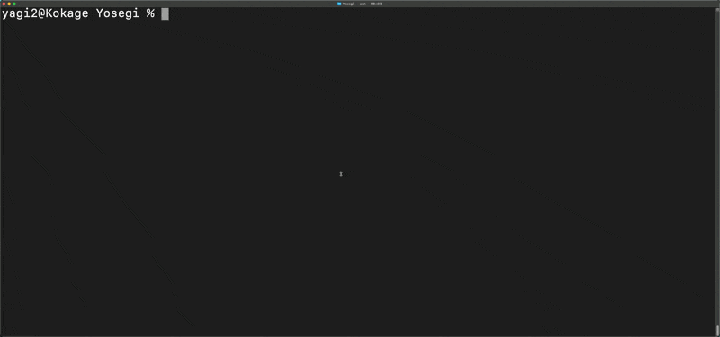

# Yosegi 🌲

[](https://github.com/yagi2/Yosegi/actions/workflows/ci.yml)
[](https://github.com/yagi2/Yosegi/actions/workflows/release.yml)
[](https://goreportcard.com/report/github.com/yagi2/yosegi)
[](https://github.com/yagi2/Yosegi/releases/latest)
[](https://opensource.org/licenses/MIT)

Interactive git worktree management tool with a beautiful TUI interface

## Overview

Yosegi is a cross-platform CLI tool designed for the modern "Vibe Coding" era, providing intuitive and visual management of git worktrees. Like `tig` or `peco`, it offers an excellent visual interface for easily managing multiple git worktrees.



## Features

- 🎯 **Interactive UI**: Beautiful terminal interface built with Bubble Tea and Lip Gloss
- 🌲 **Worktree Management**: Seamlessly create, list, and delete git worktrees
- 🎨 **Customizable Themes**: YAML-based color and UI configuration
- ⚡ **Keyboard Navigation**: Vim-style navigation (j/k) and arrow keys
- 🛡️ **Safety Features**: Confirmation prompts and accidental deletion prevention
- 🌍 **Cross-Platform**: Full support for Windows, macOS, and Linux
- 📦 **Lightweight**: Single binary with no external dependencies

## Installation

### Go Install

If you have Go 1.24 or later installed:

```bash
go install github.com/yagi2/yosegi@latest
```

### Pre-built Binaries

#### Automated Installation

**Linux/macOS:**
```bash
curl -L https://github.com/yagi2/Yosegi/releases/latest/download/yosegi_$(uname -s)_$(uname -m).tar.gz | tar xz
sudo mv yosegi /usr/local/bin/
```

**Windows (PowerShell):**
```powershell
Invoke-WebRequest -Uri "https://github.com/yagi2/Yosegi/releases/latest/download/yosegi_Windows_x86_64.zip" -OutFile "yosegi.zip"
Expand-Archive -Path "yosegi.zip" -DestinationPath "."
Move-Item yosegi.exe C:\Windows\System32\
```

#### Manual Download

Download the appropriate binary for your platform from the [releases page](https://github.com/yagi2/Yosegi/releases):

- **Linux**: `yosegi_Linux_x86_64.tar.gz` (AMD64), `yosegi_Linux_arm64.tar.gz` (ARM64)
- **macOS**: `yosegi_Darwin_x86_64.tar.gz` (Intel), `yosegi_Darwin_arm64.tar.gz` (Apple Silicon)
- **Windows**: `yosegi_Windows_x86_64.zip` (AMD64), `yosegi_Windows_arm64.zip` (ARM64)

### Build from Source

```bash
git clone https://github.com/yagi2/yosegi.git
cd yosegi
go build -o bin/yosegi .

# Or use the development task runner
go install github.com/go-task/task/v3/cmd/task@latest
task build
```

## Usage

### Basic Commands

#### List Worktrees
```bash
yosegi list     # or yosegi ls, yosegi l
```
Interactive list of all worktrees with current status indicators.

#### Create New Worktree
```bash
yosegi new [branch]              # Interactive creation
yosegi new feature-branch        # Create with specified branch (auto-creates branch if it doesn't exist)
yosegi new -b new-feature        # Explicitly create new branch and worktree
yosegi new -p ../feature feature # Specify custom path
```

#### Remove Worktree
```bash
yosegi remove   # or yosegi rm, yosegi delete
```
Safe deletion with confirmation prompts.

### Configuration

#### Initialize Configuration
```bash
yosegi config init
```
Creates a default configuration file at `~/.config/yosegi/config.yaml`.

#### Show Current Configuration
```bash
yosegi config show
```

### Configuration File

Example `~/.config/yosegi/config.yaml`:

```yaml
default_worktree_path: "../"
theme:
  primary: "#7C3AED"
  secondary: "#06B6D4" 
  success: "#10B981"
  warning: "#F59E0B"
  error: "#EF4444"
  muted: "#6B7280"
  text: "#F9FAFB"
git:
  auto_create_branch: true   # Automatically create branch if it doesn't exist
  default_remote: "origin"
  exclude_patterns: []
ui:
  show_icons: true
  confirm_delete: true
  max_path_length: 50
aliases:
  ls: "list"
  rm: "remove"
```

## Keyboard Navigation

- `↑/k`: Move up
- `↓/j`: Move down  
- `Enter`: Select/Execute
- `d`: Delete (in delete mode)
- `q`: Quit
- `Tab/Shift+Tab`: Navigate input fields

## Examples

### Typical Workflow

```bash
# List current worktrees (can run without subcommands)
yosegi
# or
yosegi list

# Create a new worktree for feature development
yosegi new feature/user-auth

# Manually navigate to the directory
cd ../feature-user-auth

# Remove worktree when done
yosegi remove
```

### Advanced Usage

```bash
# Create worktree with custom path and new branch
yosegi new -b hotfix/urgent-fix -p ../hotfix

# Force delete worktree (skip confirmation)
yosegi remove --force

# Output worktree path with interactive selection (for shell scripts)
# TUI is displayed on stderr, selection result is output to stdout
yosegi list --print
# or
yosegi ls -p
```

### Directory Navigation Integration

Using Yosegi's `--print` flag, you can easily navigate to selected worktrees. In this mode, the TUI is displayed on stderr and the selection result is output to stdout, allowing use with command substitution.

#### For Bash

```bash
# Add to ~/.bashrc
ycd() {
    local worktree=$(yosegi list --print)
    if [ -n "$worktree" ]; then
        cd "$worktree"
    fi
}

# More advanced version (with error handling)
ycd() {
    local worktree
    worktree=$(yosegi list --print 2>/dev/null)
    if [ $? -eq 0 ] && [ -n "$worktree" ]; then
        cd "$worktree"
        echo "Changed to: $worktree"
    else
        echo "No worktree selected or error occurred"
    fi
}
```

#### For Zsh

```zsh
# Add to ~/.zshrc
ycd() {
    local worktree=$(yosegi list --print)
    if [[ -n $worktree ]]; then
        cd $worktree
    fi
}
```

#### For Fish

```fish
# Save to ~/.config/fish/functions/ycd.fish
function ycd
    set worktree (yosegi list --print)
    if test -n "$worktree"
        cd $worktree
    end
end
```

#### One-liner Usage

```bash
# Direct navigation using command substitution (select in TUI then navigate)
cd $(yosegi list --print)

# Short form
cd $(yosegi ls -p)

# Note: Using `yosegi list` without command substitution
# automatically selects the first non-current worktree
cd $(yosegi list)
```

## Development

### Development Environment Setup

```bash
git clone https://github.com/yagi2/yosegi.git
cd yosegi

# Download dependencies
go mod download

# Install development task runner
go install github.com/go-task/task/v3/cmd/task@latest

# Check available tasks
task --list-all
```

### Building

```bash
# Development build
go build -o bin/yosegi .

# Release build (optimized)
task build-release

# Cross-platform build
task build-all

# Using Task (recommended)
task build
```

### Testing

```bash
# Run all tests
go test ./...

# With race condition detection
go test -race ./...

# With coverage measurement
go test -coverprofile=coverage.out ./...

# Using Task (recommended)
task test

# Short test (for development)
task test-short
```

### Quality Checks

```bash
# Linting
go fmt ./...
go vet ./...

# Security scanning
gosec ./...

# Using Task (recommended)
task lint

# CI-equivalent checks
task ci
```


### Available Task Commands

Key task commands (see all with `task --list-all`):

- `task dev` - Run in development mode
- `task build` - Development build
- `task build-release` - Optimized release build
- `task test` - Run all tests (with coverage)
- `task test-short` - Short test version
- `task lint` - Run all quality checks
- `task clean` - Clean build artifacts
- `task install` - Install to GOPATH/bin
- `task ci` - CI-equivalent checks

## Contributing

Contributions are welcome! Please follow these steps:

### Contribution Process

1. **Fork the repository**
2. **Set up development environment**
   ```bash
   git clone https://github.com/your-username/yosegi.git
   cd yosegi
   go mod download
   task dev
   ```
3. **Create feature branch**
   ```bash
   git checkout -b feature/amazing-feature
   ```
4. **Implement changes and add tests**
   ```bash
   # Implement changes
   # Run tests
   task test
   # Run linting
   task lint
   ```
5. **Commit changes**
   ```bash
   git commit -m 'feat: add amazing feature'
   ```
6. **Push to branch**
   ```bash
   git push origin feature/amazing-feature
   ```
7. **Create pull request**

### Development Guidelines

- **Commit Messages**: Use [Conventional Commits](https://conventionalcommits.org/) format
- **Code Style**: Follow `gofmt` and `golangci-lint` standards
- **Testing**: Always add tests for new features
- **Documentation**: Update README and related documentation
- **Windows Support**: Maintain cross-platform compatibility

### Bug Reports & Feature Requests

- **Bug Reports**: Report on [Issues](https://github.com/yagi2/Yosegi/issues)
- **Feature Requests**: Propose in Discussions
- **Security**: Report following [SECURITY.md](SECURITY.md)

## System Requirements

### Minimum Requirements
- **Go**: 1.24+ (for development)
- **Git**: 2.25+ (worktree feature support)
- **OS**: Windows 10+, macOS 10.15+, Linux (glibc 2.17+)

### Recommended Environment
- **Terminal**: True Color support (24-bit color)
- **Font**: Nerd Font support (for icon display)
- **Shell**: Bash, Zsh, Fish, PowerShell

### Supported Architectures
- **x86_64** (AMD64)
- **ARM64** (Apple Silicon, ARM64)
- **32-bit**: ARMv6, ARMv7 (Linux)

## License

MIT License - See [LICENSE](LICENSE) file for details.

## Acknowledgments

Yosegi was developed with inspiration from the following excellent projects and communities:

### Inspiration
- **[tig](https://github.com/jonas/tig)**: Pioneer of beautiful Git interfaces
- **[peco](https://github.com/peco/peco)**: Revolutionary interactive selection tool
- **[fzf](https://github.com/junegunn/fzf)**: High-performance fuzzy finder

### Technology Stack
- **[Bubble Tea](https://github.com/charmbracelet/bubbletea)**: Elegant TUI framework
- **[Lip Gloss](https://github.com/charmbracelet/lipgloss)**: Beautiful terminal styling
- **[Bubbles](https://github.com/charmbracelet/bubbles)**: Reusable TUI components
- **[Cobra](https://github.com/spf13/cobra)**: Powerful CLI library
- **[Go](https://golang.org/)**: Simple and high-performance language

### Development Tools
- **[GoReleaser](https://goreleaser.com/)**: Automated release management
- **[GitHub Actions](https://github.com/features/actions)**: CI/CD pipeline
- **[Task](https://taskfile.dev/)**: Modern task runner
- **[golangci-lint](https://golangci-lint.run/)**: Comprehensive code analysis

### Community
We extend our gratitude to all contributors, testers, and everyone who has provided feedback.